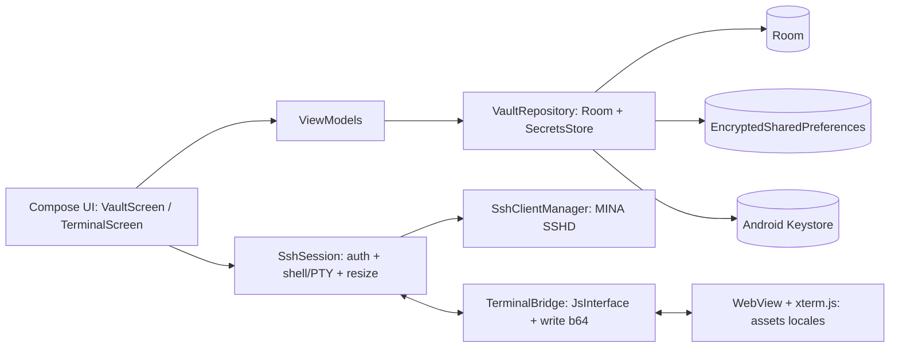
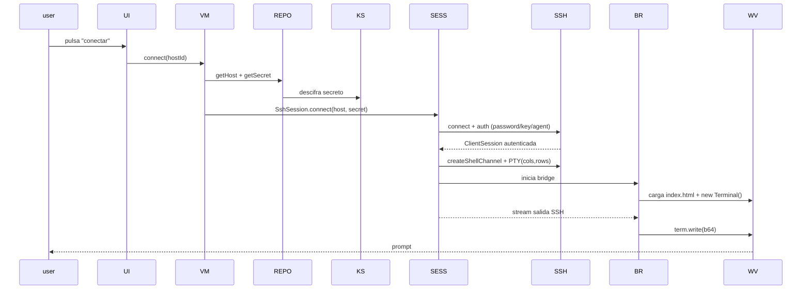
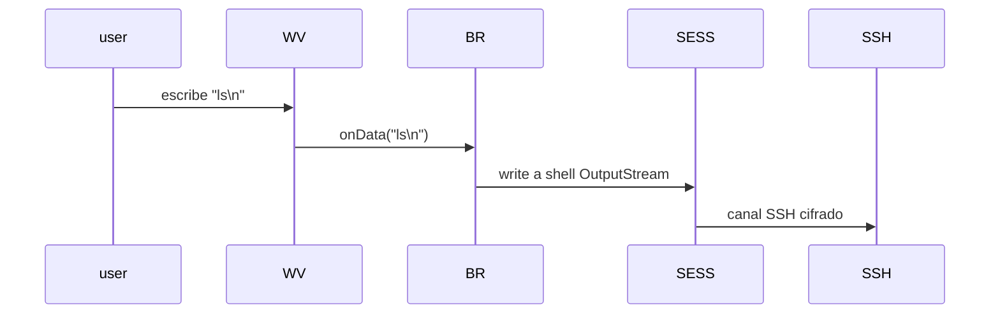
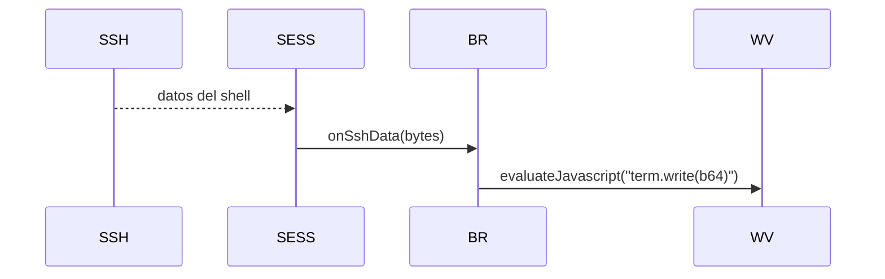
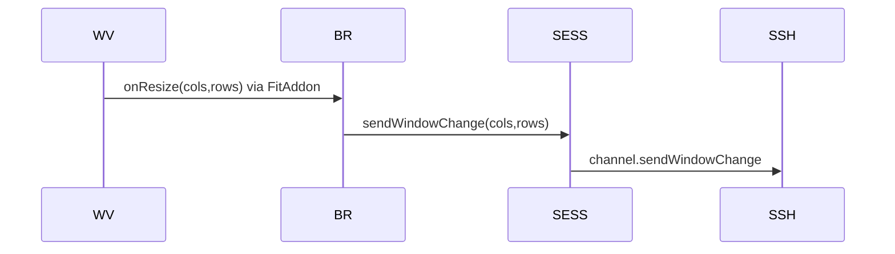

# HIM-001 — Bastion: cliente SSH multi-pestaña para Android

```
id: HIM-001
feature: bastion-ssh-client
prioridad: alta
estimacion: 13 puntos
estado: validado
dependencias: ninguna
```

---

## Visión

App Android nativa (Kotlin/Jetpack Compose) que funciona como un **Termius open-source**: un *vault* donde registrar servidores SSH (host, puerto, usuario, auth) y abrir conexiones en **pestañas** tipo terminal de escritorio. Cada pestaña = una sesión SSH independiente. **Sin shell local del dispositivo** — por seguridad, solo canales SSH salientes.

---

## Stack tecnológico

| Capa | Elección | Licencia | Justificación |
|---|---|---|---|
| Lenguaje | Kotlin + Jetpack Compose + Material 3 | Apache-2.0 | Nativo Android, control fino de terminal/ciclo de vida |
| SSH | Apache MINA SSHD 2.18.0 | Apache-2.0 | 100% Java → Android, password+publickey+agent-forwarding |
| Terminal | xterm.js 6.0.0 (WebView local) | MIT | ANSI completo (vim/tmux), sin copyleft GPL |
| Vault | Room + EncryptedSharedPreferences (Keystore) | Apache-2.0 | Secretos cifrados en reposo, metadatos en SQLite |
| Build | Docker (JDK17 + SDK Android existentes) | — | Sin instalar dependencias en servidor base |

---

## Architecture Decision Records

### ADR-001 — Kotlin + Jetpack Compose + Material 3
- **Contexto:** elegir stack de UI para Android SSH client.
- **Decisión:** Kotlin nativo con Compose. Alternativas: Flutter (plugins SSH frágiles), React Native (terminal limitada).
- **Consecuencias:** curva Gradle, depende de AndroidX.

### ADR-002 — xterm.js en WebView (vs Termux emulator GPL)
- **Contexto:** emulación de terminal ANSI para renderizar shell SSH.
- **Decisión:** xterm.js MIT en WebView con assets locales (sin red). Termux terminal-emulator GPLv3 descartado (contagia licencia de la app). Nativo descartado por coste.
- **Consecuencias:** puente JS↔Kotlin vía `addJavascriptInterface`; riesgo de `fit()` timing (mitigado).

### ADR-003 — Apache MINA SSHD 2.18.0
- **Contexto:** librería SSH cliente para Android.
- **Decisión:** MINA SSHD. JSch (viejo, ed25519 manual) y sshj (agent forwarding inmaduro) descartados.
- **Consecuencias:** jar pesado → minify off en MVP; `-keep` ProGuard.

### ADR-004 — Android Keystore + EncryptedSharedPreferences
- **Contexto:** almacenar passwords y claves privadas cifradas en reposo.
- **Decisión:** maestra en Keystore, secretos en `EncryptedSharedPreferences`. Metadatos (host, puerto) en Room.
- **Consecuencias:** secretos nunca en claro en disco; al desinstalar se pierden (por diseño).

### ADR-005 — Sin shell local
- **Contexto:** seguridad del dispositivo.
- **Decisión:** la app nunca ejecuta `Runtime.exec`/procesos locales; el único I/O es SSH.
- **Consecuencias:** todo el terminal es SSH; WebView solo renderiza y puentea bytes.

### ADR-006 — Build en Docker aislado
- **Contexto:** no instalar JDK/SDK en servidor base.
- **Decisión:** Dockerfile que monta `dev-tools/jdk-17.0.19+10` y `android-build-env/android-sdk`. APK a `~/apk-share`.
- **Consecuencias:** requiere Docker (disponible) y carpetas existentes.

---

## Modelo de datos

### Host (Room Entity)
```
id: Long (PK autogen)
name: String                     // "web1"
host: String                     // "10.0.0.5"
port: Int = 22
username: String
authType: Enum {PASSWORD, PUBLIC_KEY, AGENT_FORWARD}
useAgentForwarding: Boolean = false
createdAt: Long
updatedAt: Long
```

### Secrets (EncryptedSharedPreferences, key = "host:<id>")
```
password: String?                         // authType=PASSWORD
privateKeyPemEncrypted: String?           // PEM cifrado en base64 (authType=PUBLIC_KEY)
privateKeyPassphrase: String?
```

---

## Diagrama de componentes



---

## Diagramas de secuencia

### 4.1 Conexión (abrir pestaña)


### 4.2 Tecla → servidor (ida)


### 4.3 Salida → pantalla (vuelta)


### 4.4 Resize


---

## Máquina de estados de SshSession

```
IDLE → CONNECTING → AUTHENTICATING → SHELL_ACTIVE → CLOSING → CLOSED
                                  ↘ AUTH_FAILED
            CONNECTING ↘ CONNECT_FAILED
```
Estados expuestos al UI via `StateFlow<SessionState>`.

---

## Criterios de aceptación

| # | Criterio | Verificación |
|---|---|---|
| AC1 | Crear host → aparece en vault; password no legible en DB | Inspección DB + test SecretsStore |
| AC2 | Conectar password → pestaña muestra prompt | Prueba en dispositivo/emulador |
| AC3 | 2 pestañas mismo host → 2 sesiones SSH distintas | `who` en servidor muestra 2 sesiones |
| AC4 | Auth publickey ed25519 + passphrase → login sin password | Servidor que solo acepte key |
| AC5 | Agent forwarding → ssh otroHost funciona sin re-autenticar | Prueba salto |
| AC6 | Cerrar pestaña/app → canal SSH cerrado | `ss` en servidor |
| AC7 | Sin shell local (sin Runtime.exec) | Revisión de código + grep de ausencia |

---

## Gherkin

```gherkin
Historia de usuario:
Como usuario Android que gestiona varios servidores SSH,
quiero un vault para registrar conexiones y abrirlas en pestañas de terminal,
para operar múltiples servidores sin shell local del dispositivo.

Escenario: Registrar host con password en el vault
  Dado que no hay hosts registrados
  Cuando creo un host "web1" (host=10.0.0.5, puerto=22, user=root, auth=password, pass="secreto")
  Entonces el host "web1" aparece en la lista del vault
  Y la contraseña se guarda cifrada en EncryptedSharedPreferences, no en Room

Escenario: Abrir conexión SSH por password en pestaña
  Dado un host "web1" en el vault con auth=password
  Cuando pulso "conectar"
  Entonces se abre una pestaña con xterm.js
  Y el terminal muestra el prompt del servidor remoto

Escenario: Multi-pestaña al mismo servidor
  Dado una pestaña conectada al host "web1"
  Cuando abro una segunda pestaña y conecto al mismo host "web1"
  Entonces ambas pestañas son sesiones SSH independientes (PIDs distintos en el servidor)

Escenario: Autenticación por clave pública ed25519
  Dado un host "bastion" configurado con auth=publickey y una clave ed25519 con passphrase
  Cuando conecto al host
  Entonces la sesión se autentica con la clave privada sin pedir password

Escenario: Agent forwarding para salto a segundo host
  Dado un host "jump" con agentForwarding=true
  Cuando conecto y desde el terminal ejecuto "ssh interno"
  Entonces el segundo salto usa las claves del agente de la app (sin password)

Escenario: Cierre de pestaña
  Dado una pestaña conectada y activa
  Cuando cierro la pestaña
  Entonces la sesión SSH se cierra limpiamente
  Y el canal se libera en el servidor

Escenario: Cierre de app con sesiones activas
  Dado una o más pestañas conectadas
  Cuando la app pasa a background y es destruida
  Entonces todas las sesiones SSH se cierran

Escenario: Error de conexión
  Dado un host con IP inalcanzable
  Cuando intento conectar
  Entonces la UI muestra un error "Conexión rechazada / timeout"
  Y la pestaña no se abre
```

---

## Modelo de seguridad (profundizado)

- **Superficie de red:** solo TCP/SSH saliente al host:puerto declarado. Sin otro tráfico.
- **WebView aislado:** carga `file:///android_asset/terminal/index.html`, sin permiso de red, solo bridge vía `addJavascriptInterface` (clase `TerminalBridge` con métodos `@JavascriptInterface`).
- **Secretos en reposo:** cifrados mediante Android Keystore → `EncryptedSharedPreferences` (AES-256 GCM con maestra en Keystore). Nunca en Room.
- **Secretos en memoria:** durante la sesión, borrados al cerrar.
- **Known hosts:** `ServerKeyVerifier` persiste huellas en `EncryptedSharedPreferences`; MVP acepta first-connect sin verificación, post-MVP con confirmación.
- **Sin shell local:** ningún `Runtime.exec("sh")` o similar. El único I/O es el canal SSH.

---

## Plan de iteraciones

| Iteración | Alcance | Entregable |
|---|---|---|
| **Iter 1 (MVP)** | Scaffold + Room/Secrets + SshSession(password) + xterm bridge + VaultScreen + TerminalScreen mono-pestaña | APK funcional con vault y una conexión |
| **Iter 2** | Multi-pestaña (HorizontalPager) + auth publickey + resize + editar/eliminar hosts | Multi-sesión completo |
| **Iter 3** | Agent forwarding + known-hosts verificación + tema oscuro + polish | V1 estable |

---

## Riesgos y mitigaciones

| ID | Riesgo | I | Mitigación |
|---|---|---|---|
| R1 | xterm `fit()` en WebView con tamaño 0 → terminal en blanco | Alto | fit() tras onLayout + observer de tamaño |
| R2 | MINA SSHD rompe en Android (dex/ProGuard) | Alto | minify off; mantener en Iter 1 build |
| R3 | ed25519 no negociado "No auth methods" | Medio | Registrar BuiltinSignatures.ed25519 + eddsa/bc |
| R4 | Agent forwarding complejo | Medio | Agendado a Iter 3 |
| R5 | Bytes corruptos en bridge JS | Medio | Base64 en evaluateJavascript |
| R6 | WebView filtra datos | Medio | Sin red en WebView; solo bridge aislado |
| R7 | JDK/SDK del host no coinciden con proyecto | Bajo | Versiones fijas (JDK17, SDK api35/36) |
